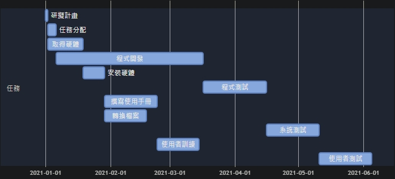
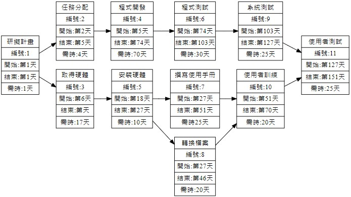

# graph

### 甘特圖


## HackHD code_mermaid
```
gantt
    title 甘特圖
    
    section 任務
    研擬計畫        :a1,2021-01-01,1d
    任務分配        :a2,after a1,4d
    取得硬體        :a3,after a1,17d
    程式開發        :a4,after a2,70d
    安裝硬體        :a5,after a3,10d
    程式測試        :a6,after a4,30d
    撰寫使用手冊     :a7,after a5,25d
    轉換檔案        :after a5,20d
    系統測試        :a8,after a6,25d
    使用者訓練      :after a7,20d
    使用者測試      :after a8,25d
```
---
### PERT/CPM 圖

</br>關鍵路徑:1➞2➞4➞6➞9➞11
## HackHD code_graphviz
```
digraph{
    node[shape=record];
    rankdir="LR";
    no1 [label="研擬計畫 | 編號:1 | 開始:第1天 | 結束:第1天 | 需時:1天"]
    no2 [label="任務分配 | 編號:2 | 開始:第2天 | 結束:第5天 | 需時:4天"]
    no3 [label="取得硬體 | 編號:3 | 開始:第6天 | 結束:第天 | 需時:17天"]
        no1->no2
    no1->no3
        {rank=same;no2 no3}
    no4 [label = "程式開發 | 編號:4 | 開始:第5天 | 結束:第74天 | 需時:70天"]
    no2->no4
    
    no5 [label = "安裝硬體 | 編號:5 | 開始:第18天 | 結束:第27天 | 需時:10天"]
    no3->no5
    
    no6 [label = "程式測試 | 編號:6 | 開始:第74天 | 結束:第103天 | 需時:30天"]
    no4->no6
     
    no7 [label = "撰寫使用手冊| 編號:7 | 開始:第27天 | 結束:第51天 | 需時25天"]
    no5->no7
      
    no8 [label = "轉換檔案 | 編號:8 | 開始:第27天 | 結束:第46天 | 需時:20天"]
    no5->no8
       {rank=same;no7 no8}
    no9 [label = "系統測試 | 編號:9 | 開始:第103天 | 結束:第127天 | 需時:25天"]
    no6->no9
        
    no10 [label = "使用者訓練 | 編號:10 | 開始:第51天 | 結束:第70天 | 需時:20天"]
    no7,no8->no10
    no11 [label = "使用者測試 | 編號:11 | 開始:第127天 | 結束:第151天 | 需時:25天"]
    no9,no10->no11
}
```
